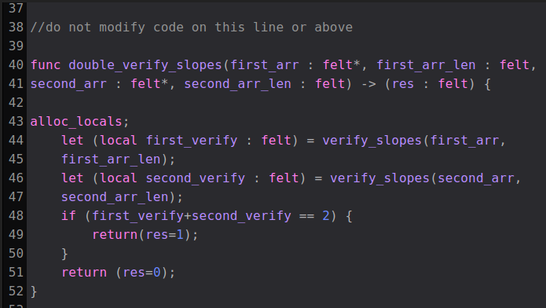

## Lección 4

Variables locales

### Descripción General

Si es nuevo en El Cairo o tiene experiencia, es posible que se haya sentido frustrado con la revocación de las referencias. Esto ocurre con frecuencia debido al hecho de que hemos estado usando `let` y `tempvar` declarando variables que se basan en el puntero de asignación (ap), piense en la memoria de montón, en lugar del puntero de marco (fp), piense en la memoria de pila.

También puede haber notado que hemos organizado nuestro código de maneras interesantes en ejercicios anteriores... Esto fue principalmente para evitar referencias revocadas.

De los documentos, tenga en cuenta que si hay una etiqueta o una instrucción de llamada (llamada a otra función. Consulte Funciones) entre la definición de una referencia que depende de ap y su uso, la referencia puede ser revocada, ya que el compilador puede no ser capaz de calcular el cambio de ap (ya que uno puede saltar a la etiqueta desde otro lugar en el programa, o llamar a una función que podría cambiar ap de una manera desconocida). Recomendamos leer las referencias a continuación para comprender bien las referencias revocadas porque ocurren con frecuencia en El Cairo cuando no se usan `local` variables.

TL; DR : nuestra regla general es no usar `let` o `tempvar` en la mayoría de los escenarios complejos, porque la probabilidad de que se revoque una variable es algo alta. En funciones simples, especialmente en funciones que no llaman a otras funciones, `let` y `tempvar` normalmente funcionarán bien. Pero, usamos `local` variables la mayor parte del tiempo.

Veamos cómo hacer uso de estas variables locales y cómo pueden mejorar nuestras vidas.

Uso de locales

```bash
%builtins output

from starkware.cairo.common.serialize import serialize_word

func main{output_ptr : felt*}() {

    alloc_locals;
    local w = 3;
    let (local x : felt) = call_func();
    let (local y : felt) = call_func();
    local z = w + x + y;
    return();
}

func call_func() -> (res: felt) {
    return (res=1);
}
```

No usar locales

```bash
%builtins output

from starkware.cairo.common.serialize import serialize_word

func main{output_ptr : felt*}() {

    let w = 3;
    let (x : felt) = call_func();
    let (y : felt) = call_func();
    let z = w + x + y;
    return();
}

func call_func() -> (res: felt) {
    return (res=1);
}
```

Si ejecuta estos dos scripts en su propio editor de código o en cairo playground (asegúrese de que se ejecuta en la versión 0.10.0 o superior de Cairo), verá que el primero tiene éxito, pero el segundo obtiene una referencia revocada para `x`. Esto se debe a que el puntero de asignación perdió el contexto `x` al evaluar `call_func` lo que define. `y`.

Nota: Puede desempaquetar `call_func` y configurarlo como local en dos pasos o puede usar el acceso directo ... `let (local x : felt)` como se ve arriba. En dos líneas quedaría así:

```bash
let (x : felt) = call_func();
local x_local = x;
```

Nota: en Cairo, no puede desempaquetar una llamada de función directamente en una variable local como:

```bash
local (x : felt) = call_func();
```

Lo último que debe tener en cuenta es que en cualquier función en la que use variables locales, debe declarar `alloc_locals` en la parte superior de esa función. Esto manejará el avance del puntero de asignación para que no tenga que mantener todo sincronizado manualmente.

## Solución

Realiza la función `double_verify_slopes`, que tendrá 4 entradas;`first_arr`,`first_arr_len` ,`second_arr` ,`second_arr_len` y una salida `res` . Esta función se ejecutará `verify_slopes` en la primera matriz y luego en la segunda y devuelve 1 si ambas pirámides son válidas y 0 en caso contrario.

Este es un ejercicio exploratorio. Explore qué hace que las funciones revoquen referencias cambiando la creación de instancias desde `tempvar`,`let`, y `local`.

```bash
%builtins output
from starkware.cairo.common.serialize import serialize_word

func main{output_ptr : felt*}() {

    alloc_locals;
    tempvar quad_pyramid_slope_angles : felt* = new (51,52,51,52);
    local quad_pyramid_slope_angles : felt* = quad_pyramid_slope_angles;
    assert quad_pyramid_slope_angles[0] = 51;
    assert quad_pyramid_slope_angles[1] = 52;
    assert quad_pyramid_slope_angles[2] = 51;
    assert quad_pyramid_slope_angles[3] = 52;
    let (is_quad_valid : felt) = verify_slopes(quad_pyramid_slope_angles, 4);
    assert is_quad_valid = 1;

    tempvar tri_pyramid_slope_angles : felt* = new (51,52,48);
    assert tri_pyramid_slope_angles[0] = 51;
    assert tri_pyramid_slope_angles[1] = 52;
    assert tri_pyramid_slope_angles[2] = 48;
    let (is_tri_valid : felt) = verify_slopes(tri_pyramid_slope_angles, 3);
    assert is_tri_valid = 0;

    let (double_verify_res : felt) = double_verify_slopes(quad_pyramid_slope_angles, 4, tri_pyramid_slope_angles, 3);
    assert double_verify_res = 0;
    return ();
}

func verify_slopes(slopes_arr : felt*, slopes_len : felt) -> (is_valid : felt) {
    if (slopes_len == 0) {
        return(is_valid=1);
    }
    if ((slopes_arr[0] - 51) * (slopes_arr[0] - 52) == 0) {
        return verify_slopes(slopes_arr+1, slopes_len-1);
    }
    return(is_valid=0);
}

//do not modify code on this line or above

func double_verify_slopes(first_arr : felt*, first_arr_len : felt, second_arr : felt*, second_arr_len : felt) -> (res : felt) {

alloc_locals;
    let (local first_verify : felt) = verify_slopes(first_arr, first_arr_len);
    let (local second_verify : felt) = verify_slopes(second_arr, second_arr_len);
    if (first_verify+second_verify == 2) {
        return(res=1);
    }
    return (res=0);
}
```


### Referencias

Para documentos oficiales de El Cairo: https://www.cairo-lang.org/docs/how_cairo_works/consts.html?highlight=local%20variable#local-vars  