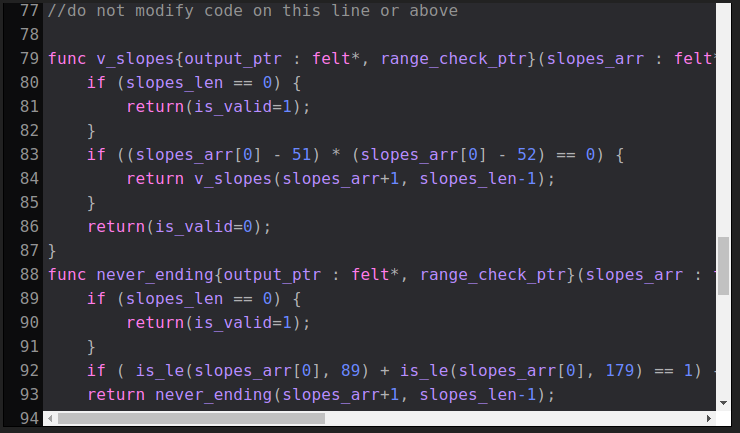
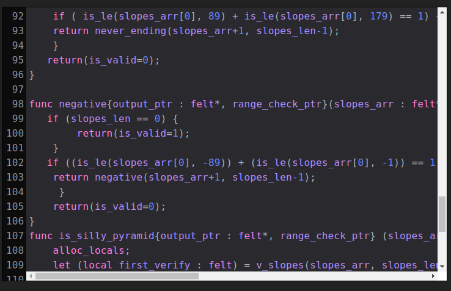
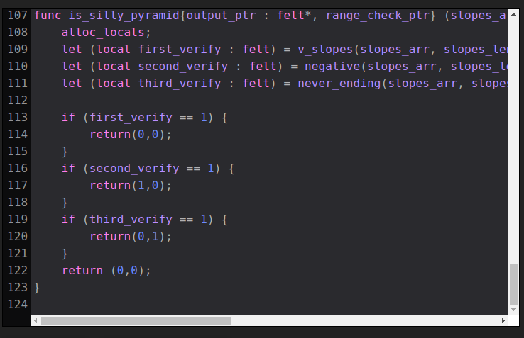

## Lección 5

Devolviendo múltiples valores y más recursividad

### Descripción general (funciones externas)

Las momias también tienen un buen sentido del humor y les encanta ver una pirámide de aspecto tonto. Una pirámide de aspecto tonto puede ser:

* Una pirámide negativa: cualquier pirámide que tenga todos sus lados con pendientes en el rango [-89, -1].
* Una pirámide interminable: cualquier pirámide que tenga todos sus lados con pendientes en el rango [90, 179].
Nuestro objetivo será verificar si las pendientes de una matriz crean una pirámide tonta.

Para ello necesitaremos utilizar una función de la biblioteca matemática de StarkNet `is_le`, que nos dirá si un valor es menor o igual a otro valor. Aquí hay un ejemplo:

```bash
%builtins output range_check

from starkware.cairo.common.serialize import serialize_word
from starkware.cairo.common.math_cmp import is_le

func main{output_ptr : felt*, range_check_ptr}() {
    let isLe : felt = is_le(0, 1);
    if (isLe == 1) {
        serialize_word(isLe);
    }
}
```

Un par de cosas a tener en cuenta aquí. Para usar la función `is_le` (es menor o igual), debemos agregar elementos `range_check` a la lista de elementos integrados en la parte superior del archivo, cada uno de los cuales está separado por un espacio. Además, necesitamos importar la función `is_le` desde `starkware.cairo.common.math_cmp`. Usaremos más y más funciones de las bibliotecas de StarkNet.

La función `is_le` devolverá 1 si el primer valor es menor o igual que el segundo valor. Nota: en Cairo para representar valores booleanos, use un `felt` con 1 para verdadero y 0 para falso.

### Descripción general (valores de retorno múltiples):

Lo siguiente que haremos será devolver 2 valores de nuestra función, `felt` uno de los cuales es `is_negative_pyramid`, y `is_never_ending_pyramid`. Podríamos lograr esto usando una variable de retorno pero por el bien del ejercicio tendrá que resolver con múltiples valores de retorno.

La sintaxis para regresar `y` y `z` con valores de 1 y 2 respectivamente en una función con entrada `x` se vería así:

```bash
func my_func(x : felt) -> (y : felt, z : felt) {

    return (y=1,z=2);

}
```

##  Solución

Rellena la función `is_silly_pyramid` para que pasen todas las aserciones. Asegúrese de usar la función `is_le` y devolver dos felts, `is_negative_pyramid` y `is_never_ending_pyramid`. Si comprende qué es una variable local, puede usarla en sus funciones, pero intente lograr esto solo usando `let` para construir su astucia en El Cairo.

Aquí le dejamos la solución final, como siempre verifique primere y copie desde comienza el ejercio.

```%builtins output range_check
from starkware.cairo.common.math_cmp import is_le
from starkware.cairo.common.serialize import serialize_word

func main{output_ptr : felt*, range_check_ptr}() {

    alloc_locals;
    tempvar quad_pyramid_slope_angles : felt* = new (51,52,51,52);
    local quad_pyramid_slope_angles : felt* = quad_pyramid_slope_angles;
    assert quad_pyramid_slope_angles[0] = 51;
    assert quad_pyramid_slope_angles[1] = 52;
    assert quad_pyramid_slope_angles[2] = 51;
    assert quad_pyramid_slope_angles[3] = 52;
    let (is_quad_valid : felt) = verify_slopes(quad_pyramid_slope_angles, 4);
    assert is_quad_valid = 1;

    tempvar tri_pyramid_slope_angles : felt* = new (51,52,48);
    assert tri_pyramid_slope_angles[0] = 51;
    assert tri_pyramid_slope_angles[1] = 52;
    assert tri_pyramid_slope_angles[2] = 48;
    let (is_tri_valid : felt) = verify_slopes(tri_pyramid_slope_angles, 3);
    assert is_tri_valid = 0;

    let (double_verify_res : felt) = double_verify_slopes(quad_pyramid_slope_angles, 4, tri_pyramid_slope_angles, 3);
    assert double_verify_res = 0;

    tempvar valid_tri_pyramid_slope_angles : felt* = new (51,52,52);
    let (is_tri_negative_pyramid : felt, is_tri_never_ending_pyramid : felt) = is_silly_pyramid(valid_tri_pyramid_slope_angles, 3);
    assert is_tri_negative_pyramid = 0;
    assert is_tri_never_ending_pyramid = 0;

    tempvar quad_full_obtuse_slope_angles : felt* = new (90,92,105,105);
    let (is_full_obtuse_negative_pyramid : felt, is_full_obtuse_never_ending_pyramid : felt) = is_silly_pyramid(quad_full_obtuse_slope_angles, 4);
    assert is_full_obtuse_negative_pyramid = 0;
    assert is_full_obtuse_never_ending_pyramid = 1;

    tempvar quad_full_negative_slope_angles : felt* = new (-1,-5,-10,-45);
    let (is_full_negative_negative_pyramid : felt, is_full_negative_never_ending_pyramid : felt) = is_silly_pyramid(quad_full_negative_slope_angles, 4);
    assert is_full_negative_negative_pyramid = 1;
    assert is_full_negative_never_ending_pyramid = 0;

    tempvar quad_partial_obtuse_slope_angles : felt* = new (90,92,89,105);
    let (is_partial_obtuse_negative_pyramid : felt, is_partial_obtuse_never_ending_pyramid : felt) = is_silly_pyramid(quad_partial_obtuse_slope_angles, 4);
    assert is_partial_obtuse_negative_pyramid = 0;
    assert is_partial_obtuse_never_ending_pyramid = 0;

    tempvar quad_partial_negative_slope_angles : felt* = new (-1,-5,10,-45);
    let (is_partial_negative_negative_pyramid : felt, is_partial_negative_never_ending_pyramid : felt) = is_silly_pyramid(quad_partial_negative_slope_angles, 4);
    assert is_partial_negative_negative_pyramid = 0;
    assert is_partial_negative_never_ending_pyramid = 0;

    return();
}


func verify_slopes(slopes_arr : felt*, slopes_len : felt) -> (is_valid : felt) {
    if (slopes_len == 0) {
        return(is_valid=1);
    }
    if ((slopes_arr[0] - 51) * (slopes_arr[0] - 52) == 0) {
        return verify_slopes(slopes_arr+1, slopes_len-1);
    }
    return(is_valid=0);
}


func double_verify_slopes(first_arr : felt*, first_arr_len : felt, second_arr : felt*, second_arr_len : felt) -> (res : felt) {
    alloc_locals;
    let (local first_verify : felt) = verify_slopes(first_arr, first_arr_len);
    let (local second_verify : felt) = verify_slopes(second_arr, second_arr_len);
    if (first_verify+second_verify == 2) {
        return(res=1);
    }
    return (res=0);
}

//do not modify code on this line or above

func v_slopes{output_ptr : felt*, range_check_ptr}(slopes_arr : felt*, slopes_len : felt) -> (is_valid : felt) {
    if (slopes_len == 0) {
        return(is_valid=1);
    }
    if ((slopes_arr[0] - 51) * (slopes_arr[0] - 52) == 0) {
        return v_slopes(slopes_arr+1, slopes_len-1);
    }
    return(is_valid=0);
}
func never_ending{output_ptr : felt*, range_check_ptr}(slopes_arr : felt*, slopes_len : felt) -> (is_valid : felt) {
    if (slopes_len == 0) {
        return(is_valid=1);
    }
    if ( is_le(slopes_arr[0], 89) + is_le(slopes_arr[0], 179) == 1) {  
    return never_ending(slopes_arr+1, slopes_len-1);
    }
   return(is_valid=0);
}

func negative{output_ptr : felt*, range_check_ptr}(slopes_arr : felt*, slopes_len : felt) -> (is_valid : felt) {    
   if (slopes_len == 0) {
        return(is_valid=1);
    }
   if ((is_le(slopes_arr[0], -89)) + (is_le(slopes_arr[0], -1)) == 1) {
    return negative(slopes_arr+1, slopes_len-1);
     }
    return(is_valid=0);
}  
func is_silly_pyramid{output_ptr : felt*, range_check_ptr} (slopes_arr : felt*, slopes_len : felt) -> ( is_negative_pyramid : felt, is_never_ending_pyramid : felt) {
    alloc_locals;
    let (local first_verify : felt) = v_slopes(slopes_arr, slopes_len);
    let (local second_verify : felt) = negative(slopes_arr, slopes_len);
    let (local third_verify : felt) = never_ending(slopes_arr, slopes_len);
   
    if (first_verify == 1) {
        return(0,0);
    }
    if (second_verify == 1) {
        return(1,0);    
    }
    if (third_verify == 1) {
        return(0,1);
    }
    return (0,0);
}
```




## Referencias 

Para documentos oficiales de El Cairo: https://www.cairo-lang.org/docs/
